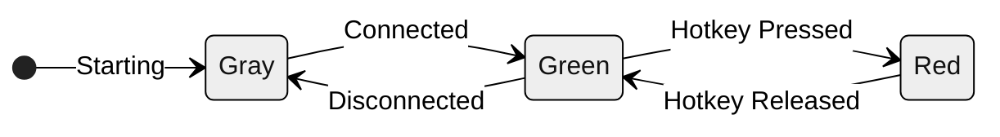
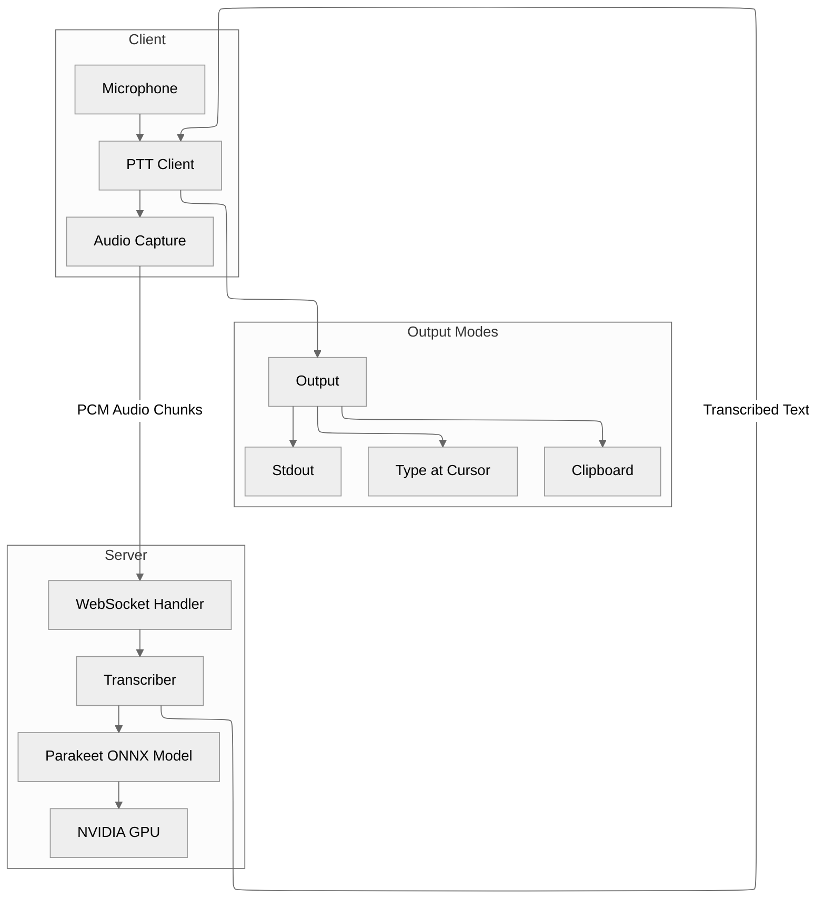
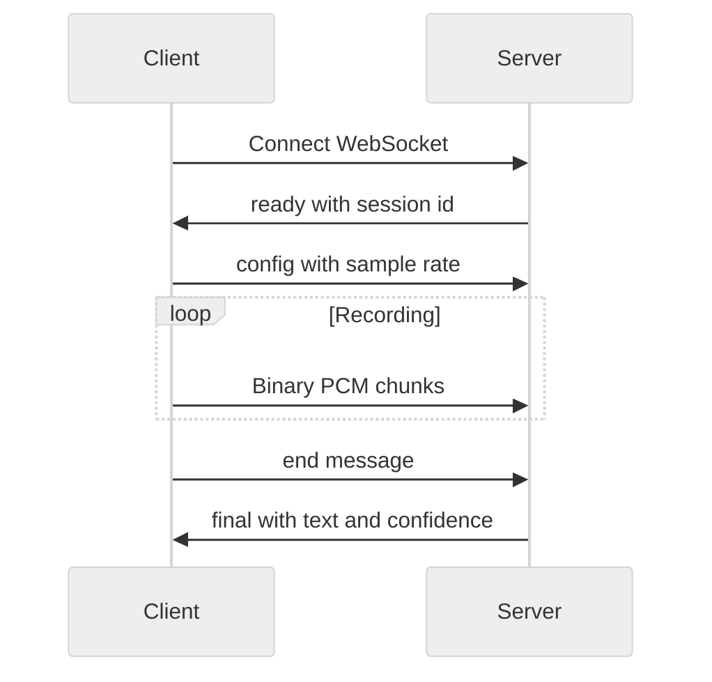

# AEO Push-to-Talk

**Dictate anywhere on your Linux desktop.** Hold Ctrl+Super, speak, release — your words appear at the cursor. GPU-accelerated, 40-200ms latency, works in any application.


## Install

One command, guided setup:

```bash
curl -fsSL https://raw.githubusercontent.com/AeyeOps/aeo-ptt-tts/main/packages/aeo-ptt/install.sh | bash
```

From a local checkout, run the same installer file; it installs or updates from
that checkout instead of downloading a release tarball:

```bash
packages/aeo-ptt/install.sh -y
```

The installer walks you through everything — dependencies, GPU setup, model download, and auto-start configuration. Just answer the prompts:

```
✓ GPU: NVIDIA GB10
✓ CUDA libraries: Found

Global Hotkey Setup
Enable Ctrl+Super hotkey for push-to-talk (works in any app)
Add yourself to input group for global hotkey? [Y/n] y
✓ Added youruser to input group

Auto-Start Server
Start STT server automatically on boot
Install systemd service for auto-start? [Y/n] y
✓ Systemd service installed

Auto-Start Client
Start AEO Push-to-Talk automatically at login (Ctrl+Super in any app)
Enable AEO Push-to-Talk auto-start? [Y/n] y
✓ Desktop entries created

════════════════════════════════════════════════════════════
  ✓ Installation complete!
════════════════════════════════════════════════════════════

Configuration:
  ✓ Global hotkey: Ctrl+Super
  ✓ Server auto-start: enabled (systemd)
  ✓ Client auto-start: enabled (tray icon at login)

► Log out and back in to activate global hotkey.
```

After logging back in, press **Ctrl+Super** in any app to dictate. Look for the green tray icon.

## Features

- **Real-time transcription** — 40-200ms latency after warmup
- **System-wide hotkey** — Ctrl+Super works in any application
- **Auto-start** — Server on boot, client at login with tray icon
- **Output modes** — Type at cursor, copy to clipboard, or print to stdout
- **Audio feedback** — Click sounds when recording starts/stops
- **GPU-accelerated** — NVIDIA Parakeet model via ONNX Runtime (CUDA/TensorRT)

## Usage

### System Tray

The tray icon shows PTT status:



| Color | State |
|-------|-------|
| Gray | Connecting to server |
| Green | Ready |
| Red | Recording |

Right-click to quit. GNOME users may need the [AppIndicator extension](https://extensions.gnome.org/extension/615/appindicator-support/).

### Output Modes

By default, text types directly into the focused window. Change with `--output`:

```bash
aeo-ptt-client --ptt                    # Type at cursor (default when auto-started)
aeo-ptt-client --ptt --output stdout    # Print to terminal
aeo-ptt-client --ptt --output clipboard # Copy to clipboard
```

When the global hotkey is available, hold **Ctrl+Super+Shift** instead of
**Ctrl+Super** to paste the next transcript with one clipboard paste operation.
Use this for apps where simulated Space keypresses trigger voice/PTT features
instead of inserting spaces.

### PTT Modes

The client auto-detects the best input method:

| Mode | Hotkey | When Used |
|------|--------|-----------|
| **Global** | Ctrl+Super | Desktop with input group access |
| **Terminal** | Spacebar | Docker, SSH, or no input access |

### Manual Start

If you skipped auto-start during install:

```bash
cd ~/aeo-ptt
./scripts/aeo-ptt-server.sh        # Terminal 1
./scripts/aeo-ptt-client.sh --ptt  # Terminal 2
```

Output shows recording duration and inference time:
```
[2.1s → 45ms] hello this is a test
[0.3s → 38ms] (silence)
```

## Uninstall

```bash
cd ~/aeo-ptt && ./install.sh --uninstall
```

---

## Configuration

All settings via environment variables. Most users won't need to change these.

### Server

| Variable | Default | Description |
|----------|---------|-------------|
| `STT_SERVER_HOST` | `127.0.0.1` | Bind address |
| `STT_SERVER_PORT` | `9876` | Port |
| `STT_MODEL_PROVIDER` | `cuda` | `cuda` or `tensorrt` |

### Client

| Variable | Default | Description |
|----------|---------|-------------|
| `STT_CLIENT_OUTPUT_MODE` | `stdout` | `stdout`, `type`, `clipboard` |
| `STT_CLIENT_SERVER_URL` | `ws://127.0.0.1:9876` | Server URL |

### Hotkeys

| Variable | Default | Description |
|----------|---------|-------------|
| `STT_PTT_HOTKEY` | `["LEFTCTRL", "LEFTMETA"]` | Global mode keys (JSON array) |
| `STT_PTT_TERMINAL_HOTKEY` | ` ` (space) | Terminal mode key |
| `STT_PTT_CLICK_SOUND` | `true` | Audio feedback |
| `STT_PTT_MAX_DURATION_SECONDS` | `30` | Auto-submit threshold |

**Customizing global hotkey** — Use [evdev key names](https://github.com/torvalds/linux/blob/master/include/uapi/linux/input-event-codes.h) without `KEY_` prefix:

```bash
export STT_PTT_HOTKEY='["LEFTCTRL", "LEFTALT"]'      # Ctrl+Alt
export STT_PTT_HOTKEY='["RIGHTCTRL", "RIGHTALT"]'   # Right Ctrl+Alt
export STT_PTT_HOTKEY='["F13"]'                      # Single key
```

---

## Troubleshooting

| Error | Fix |
|-------|-----|
| `CUDA not available` | Re-run installer, check GPU with `nvidia-smi` |
| `No accessible keyboards` | Run `sudo usermod -a -G input $USER`, log out/in |
| Server won't start | Check if port 9876 is in use: `lsof -i :9876` |

---

## Architecture



<details>
<summary><strong>Developer Setup</strong></summary>

### Git Clone

```bash
git clone https://github.com/AeyeOps/aeo-ptt-tts.git
cd aeo-ptt-tts/packages/aeo-ptt
./install.sh
```

### Docker Sandbox

```bash
./scripts/test-sandbox.sh          # Start container
# Inside: run curl installer, test PTT
./scripts/test-sandbox.sh --clean  # Rebuild image
```

### Python API

```python
from aeo_ptt import Transcriber

transcriber = Transcriber()
transcriber.load()
text = transcriber.transcribe(audio_array, sample_rate=16000)
```

### WebSocket Protocol



**Client to Server:**
```json
{"type": "config", "sample_rate": 16000}
{"type": "end"}
```

**Server to Client:**
```json
{"type": "ready", "session_id": "abc123"}
{"type": "final", "text": "hello", "confidence": 1.0}
{"type": "error", "code": "BUFFER_FULL", "message": "..."}
```

</details>

## Requirements

- NVIDIA GPU with CUDA support
- Ubuntu/Debian-based Linux (22.04/24.04 LTS)
- Python 3.12.3+

## License

MIT
